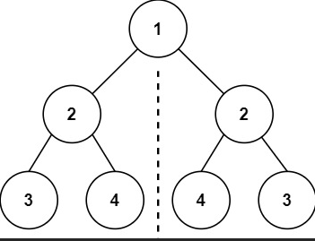

This notebook has solutions to different problems using python to improve my problem-solving skills.

## Table of Contents
### Difficulty: Easy
1.  <a href="#Two Sum">Two Sum</a>
<li><a href="#Palindrome Number">Palindrome Number</a></li>
<li><a href="#Roman to Integer">Roman to Integer</a></li>
<li><a href="#Longest Common Prefix">Longest Common Prefix</a></li>
<li><a href="#Valid Parentheses">Valid Parentheses</a></li>
<li><a href="#Merge Two Sorted Lists">Merge Two Sorted Lists</a></li>
<li><a href="#Remove Duplicates from Sorted Array">Remove Duplicates from Sorted Array</a></li>
<li><a href="#Remove Element">Remove Element</a></li>
<li><a href="#Search Insert Position">Search Insert Position</a></li>
<li><a href="#Length of Last Word">Length of Last Word</a></li>
<li><a href="#Plus One">Plus One</a></li>
<li><a href="#Add Binary">Add Binary</a></li>
<li><a href="#Sqrt(x)">Sqrt(x)</a></li>
<li><a href="#Climbing Stairs">Climbing Stairs</a></li>
<li><a href="#Remove Duplicates from Sorted List">Remove Duplicates from Sorted List</a></li>
<li><a href="#Merge Sorted Array">Merge Sorted Array</a></li>
<li><a href="#q_28">28. Find the Index of the First Occurrence in a String</a></li>
<li><a href="#bt_inorder_traversal">Binary Tree Inorder Traversal</a></li>
<li><a href="#Same_Tree">Same Tree</a></li>
<li><a href="#Symmetric_Tree">Symmetric Tree</a></li>
<li><a href="#Maximum_Depth_of_Binary_Tree">Maximum Depth of Binary Tree</a></li>
<li><a href="#Convert__Array_to_Binary_Search_Tree">Convert Sorted Array to Binary Search Tree</a></li>
<li><a href="#Balanced_Binary_Tree">Balanced_Binary_Tree</a></li>
<li><a href="#Minimum_Depth_of_Binary_Tree">Minimum_Depth_of_Binary_Tree</a></li>
<li><a href="#Path_Sum">Path_Sum</a></li>
<li><a href="#Pascal's_Triangle">Pascal's_Triangle</a></li>
<li><a href="#Pascal's_Triangle_II">Pascal's_Triangle_II</a></li>
<li><a href="#Valid_Palindrome">Valid_Palindrome</a></li>
<li><a href="#Single_Number">Single_Number</a></li>
<li><a href="#Linked_List_Cycle">Linked_List_Cycle</a></li>
<li><a href="#Binary_Tree_Preorder_Traversal">Binary_Tree_Preorder_Traversal</a></li>
<li><a href="#Binary_Tree_Postorder_Traversal">Binary_Tree_Postorder_Traversal</a></li>
<li><a href="#Write_Here">Write_Here</a></li>
<li><a href="#Write_Here">Write_Here</a></li>
<li><a href="#Write_Here">Write_Here</a></li>
<li><a href="#Write_Here">Write_Here</a></li>
<li><a href="#Write_Here">Write_Here</a></li>
<li><a href="#Write_Here">Write_Here</a></li>
<li><a href="#Write_Here">Write_Here</a></li>


```python
input().replace(' ', '_')
```

     145. Binary Tree Postorder Traversal
    


    '145._Binary_Tree_Postorder_Traversal'


```python
class TreeNode:
    def __init__(self, val=0, left=None, right=None):
        self.val = val
        self.left = left
        self.right = right
```


```python
def build_tree(level_order):
    if not level_order:
        return None
    
    # Create the root node
    root = TreeNode(level_order[0])
    queue = [root]
    i = 1
    
    # Use a queue to construct the tree level by level
    while queue and i < len(level_order):
        current_node = queue.pop(0)
        
        # Left child
        if i < len(level_order) and level_order[i] is not None:
            current_node.left = TreeNode(level_order[i])
            queue.append(current_node.left)
        i += 1
        
        # Right child
        if i < len(level_order) and level_order[i] is not None:
            current_node.right = TreeNode(level_order[i])
            queue.append(current_node.right)
        i += 1
    
    return root
```

<a id='Two Sum'></a>
### Two Sum


```python
def twoSum(nums, target):
    idx1 = 0
    idx2 = idx1 + 1
    nums_size = len(nums)
    while idx1 < nums_size - 1:
        if nums[idx1] + nums[idx2] == target:
            return [idx1, idx2]
        else:
            if idx2 == nums_size - 1:
                idx1 = idx1 + 1
                idx2 = idx1 + 1
            else:
                idx2 = idx2 + 1
                
            continue
    return []
```


```python
print(twoSum([2,7,11,15], 9))
```

    [0, 1]
    


```python
print(twoSum([3, 3], 6))
```

    [0, 1]
    


```python
print(twoSum([3, 2, 4], 6))
```

    [1, 2]
    


```python
print(twoSum([3, 2, 3], 6))
```

    [0, 2]
    

<a id='Palindrome Number'></a>
### Palindrome Number


```python
def isPalindrome(x):
    x = str(x)
    if x == x[::-1]:
        return True
    return False
```


```python
def isPalindrome(x):
    x = str(x)
    return x == x[::-1]
```


```python
val = int(input())
print(isPalindrome(val))
```

    121
    True
    

<a id='Roman to Integer'></a>
### Roman to Integer


```python
def romanToInt(s):
    roman_symbols = {'I':1, 'V':5, 'X':10, 'L':50, 'C':100, 'D':500, 'M':1000}
    sub_roman = {'IV':4, 'IX':9, 'XL':40, 'XC':90, 'CD':400, 'CM':900}
    num = 0
    while len(s) >= 2:
        if s[:2] in sub_roman.keys():
            num = num + sub_roman.get(s[:2])
            s = s[2:]
        else:
            num = num + roman_symbols.get(s[0])
            s = s[1:]
    
    if s:
        num = num + roman_symbols.get(s)
    return num 
    
```


```python
print(romanToInt("MCDLXXVI")) # 1476
```

    1476
    

<a id='Longest Common Prefix'></a>
### Longest Common Prefix


```python
def longestCommonPrefix(strs):
    '''
    This function takes a list of strings and return the longest common prefix among these strings
    '''
    prefix = 0
    check=False
    strs_sorted = sorted(strs, key=lambda x:len(x))
    print(strs_sorted)
    while not check:
        if strs_sorted[0] == "" or len(strs_sorted) == 1:
            return strs_sorted[0]
        else:
            s0 = strs_sorted[0][prefix]
        for s in strs_sorted[1:]:
            if s != "":
                if s[prefix] == s0:
                    check = False
                else:
                    check = True
                    break
            else:
                return ""
            
        if not check:
            prefix = prefix + 1
            
        if prefix == len(strs_sorted[0]):
            break
            
    if prefix == 0:
        return ""
    else:
        return strs[0][:prefix]
```


```python
longestCommonPrefix(['flower', 'flow', 'flight'])
```

    ['flow', 'flower', 'flight']
    


    'fl'


```python
def longestCommonPrefix(strs):
    prefix = ""
    size = len(sorted(strs, key=lambda x:len(x))[0])
    
    for idx in range(size):
        demo = []
        for s in strs:
            demo.append(s[idx])
        if len(set(demo)) == 1:
            prefix += demo[0]
            
        else:
            break
            
    return prefix
```


```python
longestCommonPrefix(['flower', 'flow', 'flight'])
```


    'fl'


<a id='Valid Parentheses'></a>
### Valid Parentheses


```python
def isValid(s):
        if len(s) % 2 != 0:
            return False

        stack = []
        for char in s:
            if char in ['{', '(', '[']:
                stack.append(char)
            else:
                if not stack:
                    return False
                left_brace = stack.pop()
                if left_brace == '{' and char == '}':
                    continue
                elif left_brace == '(' and char == ')':
                    continue
                elif left_brace == '[' and char == ']':
                    continue
                else:
                    return False
                
        if stack:
            return False
        return True
```


```python
def isValid(s):
    if len(s) % 2 != 0:
        return False
    stack = []
    for char in s:
        if char in ['{', '(', '[']:
            stack.append(char)
        elif char == '}' and stack and stack[-1] == '{':
            stack.pop()
        elif char == ')' and stack and stack[-1] == '(':
            stack.pop()
        elif char == ']' and stack and stack[-1] == '[':
            stack.pop()
        else:
            return False
    
    if stack:
        return False
    return True
```


```python
print(isValid('{}()[]'))
print(isValid('{([])}'))
print(isValid('{[]{}}'))
print(isValid('{()}()'))
print(isValid('[]{}()()'))
print(isValid("((}}"))
print(isValid("()]"))
```

    True
    True
    True
    True
    True
    False
    False
    

<a id='Merge Two Sorted Lists'></a>
### Merge Two Sorted Lists


```python
#Definition for singly-linked list.
class ListNode:
    def __init__(self, val=0, next=None):
        self.val = val
        self.next = next        
```


```python
def forward_linked_list(size):
    head = None
    last = None
    
    while size > 0:
        val = int(input())
        newNode = ListNode(val)
        if head == None:
            head = newNode
            last = newNode
        else:
            last.next = newNode
            last = newNode
            
        size = size - 1
    return head
```


```python
def display_linked_list(head):
    current = head
    while current:
        print(current.val, end=' ')
        if current.next:
            print(' --> ', end=' ')
        current = current.next
```


```python
list1 = forward_linked_list(3)
```

    1
    2
    4
    


```python
display_linked_list(list1)
```

    1  -->  2  -->  4 


```python
list2 = forward_linked_list(3)
```

    1
    3
    4
    


```python
display_linked_list(list2)
```

    1  -->  3  -->  4 


```python
def mergeTwoLists(list1, list2):
    if list1 == None and list2:
        return list2
    elif list1 and list2 == None:
        return list1
    elif list1 == None and list2 == None:
        return None
    
    # merge lists
    new_list = []
    current1 = list1
    while current1:
        new_list.append(current1.val)
        current1 = current1.next
        
    current2 = list2
    while current2:
        new_list.append(current2.val)
        current2 = current2.next
        
    # sort list
    new_list = sorted(new_list)
    head = None
    last = None
    for item in new_list:
        newNode = ListNode(item)
        if head == None:
            head = newNode
            last = newNode
        else:
            last.next = newNode
            last = newNode
    return head
```


```python
newlist = mergeTwoLists(list1, list2)
display_linked_list(newlist)
```

    1  -->  1  -->  2  -->  3  -->  4  -->  4 

<a id='Remove Duplicates from Sorted Array'></a>
### Remove Duplicates from Sorted Array


```python
def removeDuplicates(nums):
    idx = 1
    while True:
        if len(nums) >= 2:
            if nums[idx] == nums[idx-1]:
                nums.pop(idx)
                if idx > 1:
                    idx = idx - 1
            elif idx < len(nums) - 1:
                idx = idx + 1
                continue
            else:
                break
        else:
            break
    return len(nums)
```


```python
def removeDuplicates(nums):
    last = 0
    for i in range(1, len(nums)):
        if nums[i] == nums[i - 1] or nums[i - 1] == '_' and nums[i] == nums[last]:
            nums[i] = '_'
        elif nums[i - 1] == '_':
            nums[last + 1] = nums[i]
            nums[i] = '_'
            last = last + 1
        else:
            last = last + 1
        
    for _ in range(nums.count('_')):
        nums.remove('_')
    return len(nums)
```


```python
def removeDuplicates(nums):
    for i in range(len(nums)):
        try:
            for _ in range(nums.count(nums[i]) - 1):
                nums.remove(nums[i])
        except:
            break
            
    return len(nums)
```


```python
def removeDuplicates(nums):
    last = 1
    for idx in range(len(nums) - 1):
        if nums[idx] != nums[idx+1]:
            nums[last] = nums[idx+1]
            last += 1
    return last
```

<a id='Remove Element'></a>
### Remove Element


```python
def removeElement(nums, val):
    for _ in range(nums.count(val)):
        nums.remove(val)
    return len(nums)
```

<a id='Search Insert Position'></a>
### Search Insert Position


```python
def searchInsert(nums, target):
    for idx in range(len(nums)):
        if target > nums[idx]:
            continue
        else:
            return idx
            
    return idx + 1
```

<a id='Length of Last Word'></a>
### Length of Last Word


```python
def lengthOfLastWord(s):
    return len(s.split()[-1])
```

<a id='Plus One'></a>
### Plus One


```python
def plusOne(digits):
    num = int(''.join([str(digit) for digit in digits])) + 1
    digits = []
    for digit in str(num):
        digits.append(int(digit))
    return digits
```


```python
def plusOne(digits):
    num = int(''.join([str(digit) for digit in digits])) + 1
    return [int(digit) for digit in str(num)]
```

<a id='Add Binary'></a>
### Add Binary


```python
def addBinary(a, b):
        idx_a = 0
        idx_b = 0
        final_res = ''
        remind = 0
        a = a[::-1]
        b = b[::-1]

        def get_res(num_a=0, num_b=0, remind=0):
            val = int(num_a) + int(num_b) + remind
            if val > 1:
                remind = 1
            else:
                remind = 0
            return str(val % 2), remind

        while idx_a < len(a) or idx_b < len(b):
            res = ''
            if idx_a < len(a) and idx_b < len(b):
                res, remind = get_res(a[idx_a], b[idx_b], remind)
                final_res = res + final_res
                idx_a += 1
                idx_b += 1
            elif idx_a < len(a) and idx_b >= len(b):
                res, remind = get_res(num_a=a[idx_a], remind=remind)
                final_res = res + final_res
                idx_a += 1
            else:
                res, remind = get_res(num_b = b[idx_b], remind=remind)
                final_res = res + final_res
                idx_b += 1

        if remind == 1:
            final_res = '1' + final_res
        return final_res
```


```python
def addBinary(a, b):
    idx_a = len(a) - 1
    idx_b = len(b) - 1
    final_res = ''
    carry = 0

    while idx_a >= 0 or idx_b >= 0:
            sum = carry
            if idx_a >= 0:
                sum += int(a[idx_a])
            if idx_b >= 0:
                sum += int(b[idx_b])

            idx_a, idx_b = idx_a - 1, idx_b - 1

            carry = 1 if sum > 1 else 0
            final_res += str(sum % 2)

    if carry != 0:
        final_res += str(carry)
    return final_res[::-1]
```

<a id='Sqrt(x)'></a>
### Sqrt(x)


```python
# using Newton Raphson Method

def mySqrt(x):
    x_0 = 1
    while True:
        x_1 = x_0 - ((x_0**2 - x)/(2 * x_0))
        if abs(x_1 - x_0) < 1e-5:
            break
        x_0 = x_1
    return int(x_1)
```

<a id='Climbing Stairs'></a>
### Climbing Stairs


```python
def climbStairs(n):
    if n == 1:
        return 1
    if n == 2:
        return 2
    if n == 3:
        return 3
    
    res = [2, 3, 0]
        
    for _ in range(n-3):
        res[2] = res[0] + res[1]
        res[0] = res[1]
        res[1] = res[2]
    return res[2]
```

<a id='Remove Duplicates from Sorted List'></a>
### Remove Duplicates from Sorted List


```python
    """head: head of sorted linked list
    return linked list with no duplicates"""
    if head == None:
        return head
    
    newNode = ListNode(head.val)
    newlist = newNode
    last = newNode
    current = head.next
    while current != None:
        if current.val != last.val:
            newNode = ListNode(current.val)
            last.next = newNode
            last = newNode
        current = current.next
    return newlist
```

<a id='Merge Sorted Array'></a>
### Merge Sorted Array


```python
def merge(nums1, m, nums2, n):
    for idx, val in enumerate(nums2):
        nums1[m+idx] = val
    nums1.sort()
```

<a id='q_28'></a>
### 28. Find the Index of the First Occurrence in a String


```python
def strStr(haystack, needle):
    """
    :type haystack: str
    :type needle: str
    :rtype: int
    """
    return haystack.find(needle)
```


```python
# test
haystack = "sadbutsad" 
needle = "sad"
assert strStr(haystack, needle) == 0
```


```python
haystack = "leetcode" 
needle = "leeto"
assert strStr(haystack, needle) == -1
```

<a id='bt_inorder_traversal'></a>
### Binary Tree Inorder Traversal


```python
# Definition for a binary tree node.
class TreeNode:
    def __init__(self, val=0, left=None, right=None):
     self.val = val
     self.left = left
     self.right = right
```


```python
# inorderTraversal (left - root - right)
def inorderTraversal(root):
    result = []
    if not root:
        return []
    result += inorderTraversal(root.left)
    result.append(root.val)
    result += inorderTraversal(root.right)
    return result
```


```python
root = TreeNode(val=1, right = TreeNode(val=2, left=TreeNode(val=3)))
inorderTraversal(root)
```


    [1, 3, 2]


```python
inorderTraversal(None)
```


    []


```python
root = TreeNode(val=1)
inorderTraversal(root)
```


    [1]


<a id='Same_Tree'></a>
### Same Tree


```python
class TreeNode:
    def __init__(self, val=0, left=None, right=None):
        self.val = val
        self.left = left
        self.right = right
```


```python
def isSameTree(p, q) -> bool:
    if not p and not q:
        return True
    if not p or not q:
        return False

    # check the root 
    if p.val == q.val:
        # check the left and the right subtrees if the roots are equal
        return isSameTree(p.left, q.left) and isSameTree(p.right, q.right)
    return False
```


```python
n1 = TreeNode(val=1, right = TreeNode(val=3), left=TreeNode(val=2))
n2 = TreeNode(val=6, right = TreeNode(val=3), left=TreeNode(val=2))

isSameTree(n1, n2)
```


    False


<a id='Symmetric_Tree'></a>
### Symmetric Tree




```python
class TreeNode:
    def __init__(self, val=0, left=None, right=None):
        self.val = val
        self.left = left
        self.right = right
```


```python
def isMirror(left, right):
    if not left and not right:
        return True
    if not left or not right:
        return False
    return left.val == right.val and isMirror(left.left, right.right) and isMirror(left.right, right.left)
    
def isSymmetric(root) -> bool:
    if not root:
        return True
    return isMirror(root.left, root.right)
```


```python
root = TreeNode(val=1, left=TreeNode(val=2, right=TreeNode(val=4)), 
                       right=TreeNode(val=2, right=TreeNode(val=3)))
```


```python
isSymmetric(root)
```


    False


<a id='Maximum_Depth_of_Binary_Tree'></a>
### Maximum Depth of Binary Tree


```python
def maxDepth(root) -> int:
    if not root:
        return 0
    return max(maxDepth(root.left), maxDepth(root.right)) + 1
```


```python
max(1, 2)
```


    2


<a id='Convert__Array_to_Binary_Search_Tree'></a>
### Convert Sorted Array to Binary Search Tree


```python
class TreeNode:
    def __init__(self, val=0, left=None, right=None):
        self.val = val
        self.left = left
        self.right = right
```


```python
def sortedArrayToBST(nums):
    if not nums:
        return None
    mid = len(nums) // 2
    root = TreeNode(val=nums[mid])
    root.left = sortedArrayToBST(nums[:mid])
    root.right = sortedArrayToBST(nums[mid + 1:])
    return root
```

<a id='Balanced_Binary_Tree'></a>
### Balanced_Binary_Tree


```python
class TreeNode:
    def __init__(self, val=0, left=None, right=None):
        self.val = val
        self.left = left
        self.right = right
```


```python
def maxDepth(root):
    if not root:
        return 0
    return max(maxDepth(root.left), maxDepth(root.right)) + 1
```


```python
def isBalanced(root) -> bool:
    if not root:
        return True
    left_max_depth = maxDepth(root.left)
    right_max_depth = maxDepth(root.right)
    
    # Check if the current node is balanced and if both subtrees are balanced
    return abs(left_max_depth - right_max_depth) <= 1 and \
           isBalanced(root.left) and \
           isBalanced(root.right)
```


```python
root = TreeNode(val=3, left=TreeNode(val=9), right=TreeNode(val=20, left=TreeNode(val=15), right=TreeNode(val=7)))
isBalanced(root)
```


    True


```python
root = TreeNode(val=1, left=TreeNode(val=2, left=TreeNode(val=3, left=TreeNode(val=4), 
                                                                 right=TreeNode(val=4)),
                                            right=TreeNode(val=3)), 
                       right=TreeNode(val=2))
isBalanced(root)
```


    False


<a id='Minimum_Depth_of_Binary_Tree'></a>
### Minimum_Depth_of_Binary_Tree


```python
def minDepth(root) -> int:
    if not root:
        return 0
        
    if root.left and not root.right:
        return minDepth(root.left) + 1
    elif root.right and not root.left:
        return minDepth(root.right) + 1
    else:
        return min(minDepth(root.left) + 1, minDepth(root.right) + 1)
```


```python
class TreeNode:
    def __init__(self, val=0, left=None, right=None):
        self.val = val
        self.left = left
        self.right = right
```


```python
def build_tree(level_order):
    if not level_order:
        return None
    
    # Create the root node
    root = TreeNode(level_order[0])
    queue = [root]
    i = 1
    
    # Use a queue to construct the tree level by level
    while queue and i < len(level_order):
        current_node = queue.pop(0)
        
        # Left child
        if i < len(level_order) and level_order[i] is not None:
            current_node.left = TreeNode(level_order[i])
            queue.append(current_node.left)
        i += 1
        
        # Right child
        if i < len(level_order) and level_order[i] is not None:
            current_node.right = TreeNode(level_order[i])
            queue.append(current_node.right)
        i += 1
    
    return root
```


```python
root = build_tree([3,9,20,None,None,15,7])

minDepth(root)
```


    2


```python
root = build_tree([2,None,3,None,4,None,5,None,6])
minDepth(root)
```


    5


<a id='Path_Sum'></a>
### Path_Sum


```python
root = build_tree([5,4,8,11,None,13,4,7,2,None,None,None,1])
#root = build_tree([1,2,3])
```


```python
def hasPathSum(root, targetSum: int) -> bool:
    if not root:
        return False
    if not root.left and not root.right:
        return targetSum == root.val

    return hasPathSum(root.left, targetSum - root.val) or hasPathSum(root.right, targetSum - root.val)
```


```python
hasPathSum(root, 22)
```


    True


<a id="Pascal's_Triangle"></a>
### Pascal's_Triangle


```python
def generate(numRows: int) -> list[list[int]]:
    triangle = []
    for i in range(numRows):
        triangle.append([1])
        for j in range(1, i + 1):
            if i == j:
                triangle[i].append(1)
            else:
                triangle[i].append(triangle[i-1][j] + triangle[i-1][j-1])
    return triangle
```


```python
generate(5)
```


    [[1], [1, 1], [1, 2, 1], [1, 3, 3, 1], [1, 4, 6, 4, 1]]


<a id="Pascal's_Triangle_II"></a>
### Pascal's_Triangle_II


```python
def getRow(rowIndex: int) -> list[int]:
    triangle = []
    for i in range(rowIndex + 1):
        triangle.append([1])
        for j in range(1, i + 1):
            if i == j:
                triangle[i].append(1)
            else:
                triangle[i].append(triangle[i-1][j] + triangle[i-1][j-1])
    return triangle[rowIndex]
```


```python
getRow(1)
```


    [1, 1]


<a id='Valid_Palindrome'></a>
### Valid_Palindrome


```python
def isPalindrome(s: str) -> bool:
    pattern = re.compile(r'[A-Za-z0-9]')
    res = re.findall(pattern, s.lower())
    res = ''.join(res)
    if res == res[::-1]:
        return True
    return False
```


```python
s = "A man, a plan, a canal: Panama"
#s = "race a car"
#s = " "
isPalindrome(s)
```


    True


```python
import re
def isPalindrome(s: str) -> bool:
    pattern = re.compile(r'[A-Za-z0-9]')
    res = re.findall(pattern, s.lower())
    res = ''.join(res)
    
    if res == "":
        return True
        
    size = len(res)
    start = 0
    end = size - 1
    while start < end:
        if res[start] == res[end]:
            start += 1
            end -= 1
        else:
            return False
            
    return True
```


```python
s = "A man, a plan, a canal: Panama"
#s = "race a car"
#s = " "
isPalindrome(s)
```


    True


<a id='Single_Number'></a>
### Single_Number


```python
def singleNumber(nums: list[int]) -> int:
    uniqueNum = 0
    
    for n in nums:
        uniqueNum ^= n
        
    return uniqueNum
```


```python
#nums = [2,2,1]
nums = [4,1,2,1,2]
singleNumber(nums)
```


    4


<a id='Linked_List_Cycle'></a>
### Linked_List_Cycle


```python
# Definition for singly-linked list.
class ListNode:
    def __init__(self, x):
        self.val = x
        self.next = None

```


```python
def hasCycle(head: ListNode) -> bool:
    nodes = []
    while head:
        if head in nodes:
            return False
        nodes.append(head)
        head = head.next
    return True
```


```python
def hasCycle(head: ListNode) -> bool:
    fast = head
    slow = head
    while fast and fast.next:
        fast = fast.next.next
        slow = slow.next
        if fast == slow:
            return True
    return False
```


```python
head = ListNode(3)
head.next = ListNode(2)
head.next.next = ListNode(0)
head.next.next.next = ListNode(-4)
head.next.next.next.next = head.next
hasCycle(head)
```


    True


<a id='Binary_Tree_Preorder_Traversal'></a>
### Binary_Tree_Preorder_Traversal


```python
def preorderTraversal(root) -> list[int]:
    if not root:
        return []
    lst = []
    lst.append(root.val)
    lst += preorderTraversal(root.left)
    lst += preorderTraversal(root.right)
    return lst
```


```python
root = build_tree([1,2,3,4,5,None,8,None,None,6,7,9])
preorderTraversal(root)
```


    [1, 2, 4, 5, 6, 7, 3, 8, 9]


<a id='Binary_Tree_Postorder_Traversal'></a>
### Binary_Tree_Postorder_Traversal


```python
def postorderTraversal(root: TreeNode) -> list[int]:
    if not root:
        return []

    lst = []
    lst += postorderTraversal(root.left)
    lst += postorderTraversal(root.right)
    lst.append(root.val)
    return lst
```


```python
root = build_tree([1,2,3,4,5,None,8,None,None,6,7,9])
postorderTraversal(root)
```


    [4, 6, 7, 5, 2, 9, 8, 3, 1]


```python
<a id='Refer_to'></a>
### Refer_to
```


```python
<a id='Refer_to'></a>
### Refer_to
```


```python
<a id='Refer_to'></a>
### Refer_to
```


```python
<a id='Refer_to'></a>
### Refer_to
```


```python
<a id='Refer_to'></a>
### Refer_to
```


```python
<a id='Refer_to'></a>
### Refer_to
```


```python
<a id='Refer_to'></a>
### Refer_to
```


```python
<a id='Refer_to'></a>
### Refer_to
```


```python
<a id='Refer_to'></a>
### Refer_to
```


```python
<a id='Refer_to'></a>
### Refer_to
```


```python
<a id='Refer_to'></a>
### Refer_to
```


```python
<a id='Refer_to'></a>
### Refer_to
```


```python
<a id='Refer_to'></a>
### Refer_to
```


```python
<a id='Refer_to'></a>
### Refer_to
```


```python
<a id='Refer_to'></a>
### Refer_to
```


```python
<a id='Refer_to'></a>
### Refer_to
```


```python
<a id='Refer_to'></a>
### Refer_to
```


```python
<a id='Refer_to'></a>
### Refer_to
```


```python
<a id='Refer_to'></a>
### Refer_to
```


```python
<a id='Refer_to'></a>
### Refer_to
```


```python
<a id='Refer_to'></a>
### Refer_to
```


```python
<a id='Refer_to'></a>
### Refer_to
```


```python
<a id='Refer_to'></a>
### Refer_to
```


```python
<a id='Refer_to'></a>
### Refer_to
```


```python
<a id='Refer_to'></a>
### Refer_to
```


```python
<a id='Refer_to'></a>
### Refer_to
```
